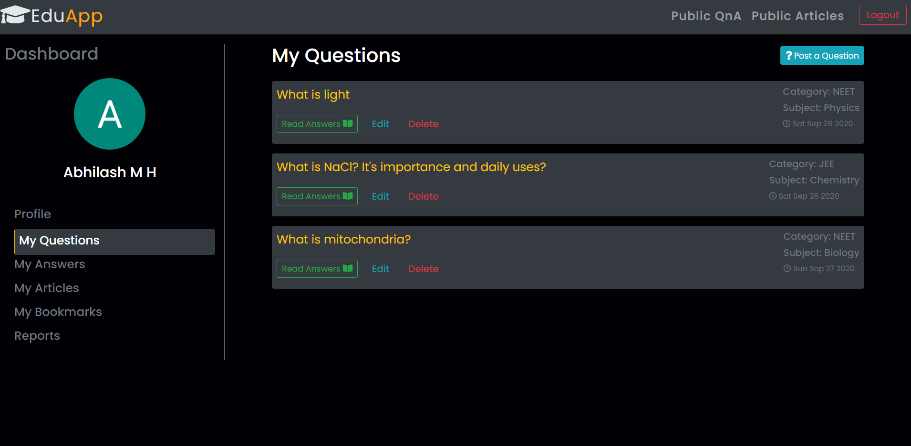

# Edu-App

> My work as a fullstack web intern at SiteX Digitech.

**The features that I have worked on are:**

- Users can post their doubts and other users reply with relevant answers.
- Users can post an article of any topic of their choice.
- Users can bookmark the answers and articles for reference.
- Users can report other user's question/answer/article if they are spam or invalid or irrelevant.
- Ensures complete **authentication** and **authorization** on CRUD operations.

### Tech Stack
`React` `Firebase`

